# Architecture Diagram

## Infrastructure Overview

```mermaid
%%{init: {'theme': 'base', 'themeVariables': { 'fontFamily': 'Segoe UI, sans-serif', 'fontSize': '14px', 'primaryColor': '#e0f2fe', 'primaryTextColor': '#1e293b', 'primaryBorderColor': '#0284c7', 'lineColor': '#64748b', 'secondaryColor': '#f0fdf4', 'tertiaryColor': '#fef3c7' }, 'flowchart': { 'useMaxWidth': false, 'nodeSpacing': 40, 'rankSpacing': 80, 'curve': 'basis', 'htmlLabels': true } }}%%

flowchart LR

    %% ── WHO CONNECTS ──────────────────────────────────────────
    subgraph Users [" 👤  Users "]
        direction TB
        User(["API Client"])
        Teams(["Teams User"])
        Admin(["Admin / Portal"])
        VPN(["VPN Client"])
    end

    %% ── HOW THEY GET IN ───────────────────────────────────────
    subgraph Edge [" 🛡️  Edge / Ingress "]
        direction TB
        AppGW["App Gateway\n+ WAF v2"]
        Bot["Bot Service\n+ Teams Channel"]
        Bastion["Azure Bastion"]
        VPNGw["VPN Gateway"]
    end

    %% ── PRIVATE NETWORK ───────────────────────────────────────
    subgraph Network [" 🔒  Virtual Network  (192.168.0.0/16) "]
        direction TB

        subgraph Compute [" Compute Subnets "]
            direction LR
            ToolServer["Agent Tool Server\n(agent-subnet)"]
            MCPApps["MCP Servers\n(mcp-subnet)"]
            JumpBox["Jump Box VM\n(pe-subnet)"]
        end

        subgraph PrivateLinks [" Private Endpoints  (pe-subnet) "]
            direction LR
            pAPIM{{"APIM"}}
            pAI{{"AI Services"}}
            pSearch{{"AI Search"}}
            pStorage{{"Storage"}}
            pCosmos{{"Cosmos DB"}}
            pOpenAI{{"Cross-region\nOpenAI"}}
        end

        NAT["NAT Gateway"]
    end

    %% ── AI FOUNDRY ────────────────────────────────────────────
    subgraph Foundry [" 🧠  AI Foundry  (primary region, public access disabled) "]
        direction TB

        subgraph Apps [" Published Applications "]
            direction LR
            GWApp["apim-gateway-app"]
            PipeApp["marketing-pipeline-app"]
        end

        subgraph AgentLayer [" Agents & Workflows "]
            direction LR
            GWAgent["Gateway Agent\ngpt-4o-mini"]
            CrossAgent["Cross-region Agent\ngpt-4o"]
            Pipeline["Marketing Pipeline\nAnalyst ➜ Writer ➜ Editor"]
        end

        subgraph Conn [" Project Connections "]
            direction LR
            cAPIM["APIM Gateway"]
            cSearch["AI Search"]
            cStorage["Storage"]
            cCosmos["Cosmos DB"]
            cAppIns["App Insights"]
        end

        Models["Model Deployments\ngpt-4o-mini  •  gpt-5.4-nano"]
    end

    %% ── APIM GATEWAY ─────────────────────────────────────────
    subgraph APIM [" 🔀  APIM Gateway  (private) "]
        direction TB
        APIMCore["APIM StandardV2"]
        APIMPolicy["Managed Identity\n➜ Cognitive Services"]
    end

    %% ── BACKEND DATA ─────────────────────────────────────────
    subgraph Backend [" 💾  Backend Data  (private) "]
        direction TB
        Search["AI Search"]
        Storage["Storage Account"]
        Cosmos["Cosmos DB"]
    end

    %% ── CROSS-REGION ─────────────────────────────────────────
    subgraph XRegion [" 🌎  Cross-region OpenAI "]
        direction TB
        XOpenAI["Azure OpenAI\n(westus)"]
        XModel["gpt-4o"]
    end

    %% ── OBSERVABILITY ────────────────────────────────────────
    subgraph Observe [" 📊  Observability "]
        direction TB
        AppIns["Application Insights"]
        LogAn["Log Analytics"]
        DNSZones["Private DNS\n(7 zones)"]
    end

    %% ═══════════════════════════════════════════════════════════
    %% CONNECTIONS — grouped by traffic pattern
    %% ═══════════════════════════════════════════════════════════

    %% --- User → Edge ---
    User -- "Responses API" --> AppGW
    Teams -- "chat message" --> Bot -- "POST /bot" --> AppGW
    Admin -- "portal" --> Bastion
    VPN -- "P2S tunnel" --> VPNGw

    %% --- Edge → Network ---
    AppGW -- "TLS termination" --> pAPIM
    Bastion --> JumpBox
    VPNGw --> JumpBox
    NAT -. "outbound internet" .-> JumpBox

    %% --- Network → Foundry (via private endpoints) ---
    pAPIM --> APIMCore
    pAI --> Models

    %% --- Foundry internal ---
    GWApp --> GWAgent
    PipeApp --> Pipeline
    Pipeline --> GWAgent
    GWAgent --> cAPIM
    CrossAgent --> cAPIM

    %% --- Connections → Private Endpoints ---
    cAPIM -- "model traffic\n(API key)" --> pAPIM
    cSearch --> pSearch
    cStorage --> pStorage
    cCosmos --> pCosmos

    %% --- APIM → backends ---
    APIMCore --> APIMPolicy
    APIMPolicy -- "managed identity\nauth" --> pAI
    APIMCore -- "cross-region\nroute via VNet" --> pOpenAI

    %% --- Private Endpoints → backends ---
    pSearch --> Search
    pStorage --> Storage
    pCosmos --> Cosmos
    pOpenAI --> XOpenAI --> XModel

    %% --- Compute → data ---
    ToolServer --> pSearch
    ToolServer --> pStorage
    MCPApps -. "private" .-> pAPIM

    %% --- Observability ---
    Foundry -. "OpenTelemetry\ntraces" .-> AppIns --> LogAn
    DNSZones -. "name resolution" .-> Network

    %% ═══════════════════════════════════════════════════════════
    %% STYLES — five distinct roles
    %% ═══════════════════════════════════════════════════════════
    classDef user fill:#fef3c7,stroke:#d97706,stroke-width:1.5px,color:#78350f
    classDef edge fill:#fce7f3,stroke:#db2777,stroke-width:1.5px,color:#831843
    classDef net  fill:#dbeafe,stroke:#2563eb,stroke-width:1.5px,color:#1e3a8a
    classDef ai   fill:#ccfbf1,stroke:#0d9488,stroke-width:1.5px,color:#134e4a
    classDef data fill:#fee2e2,stroke:#dc2626,stroke-width:1.5px,color:#7f1d1d
    classDef obs  fill:#f1f5f9,stroke:#64748b,stroke-width:1.5px,color:#334155
    classDef pe   fill:#e0e7ff,stroke:#4f46e5,stroke-width:1px,color:#3730a3

    class User,Teams,Admin,VPN user
    class AppGW,Bot,Bastion,VPNGw edge
    class ToolServer,MCPApps,JumpBox,NAT net
    class pAPIM,pAI,pSearch,pStorage,pCosmos,pOpenAI pe
    class GWApp,PipeApp,GWAgent,CrossAgent,Pipeline,cAPIM,cSearch,cStorage,cCosmos,cAppIns,Models,APIMCore,APIMPolicy ai
    class Search,Storage,Cosmos,XOpenAI,XModel data
    class AppIns,LogAn,DNSZones obs
```

## Notes

- This overview is intentionally simplified so the main trust boundaries and traffic paths are readable in one frame.
- Detailed request-by-request behavior is already captured in `sequence-diagram.md` and is better kept there than folded into the topology view.
- The private endpoint zone still represents AI Services, AI Search, Storage, Cosmos DB, APIM, and the cross-region OpenAI endpoint.
