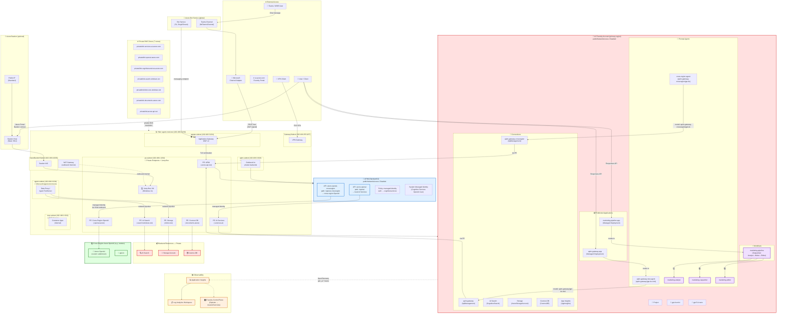

# Architecture Diagram

## Infrastructure Overview

```mermaid
graph TB
    %% ============================================================
    %% External Access
    %% ============================================================
    subgraph External["🌐 External Access"]
        User["👤 User / Client"]
        Portal["🌐 ai.azure.com\nFoundry Portal"]
        VPNClient["🔐 VPN Client"]
        TeamsUser["💬 Teams / M365 User"]
        ChannelAdapter["📡 Microsoft\nChannel Adapter"]
    end

    %% ============================================================
    %% Azure Bastion + Jump Box
    %% ============================================================
    subgraph Bastion["🏰 Azure Bastion (optional)"]
        BastionHost["Bastion Host\n(Basic SKU)"]
        BastionPIP["Public IP\n(Standard)"]
    end

    %% ============================================================
    %% Virtual Network
    %% ============================================================
    subgraph VNet["🔒 VNet: agent-vnet-test (192.168.0.0/16)"]

        subgraph AgentSubnet["agent-subnet (192.168.0.0/24)\n🤖 Microsoft.App/environments"]
            DataProxy["Data Proxy /\nAgent ToolServer"]
        end

        subgraph PESubnet["pe-subnet (192.168.1.0/24)\n🔗 Private Endpoints + Jump Box"]
            PE_AI["PE: AI Services\n(.services.ai)"]
            PE_Search["PE: AI Search\n(.search.windows.net)"]
            PE_Storage["PE: Storage\n(.blob.core)"]
            PE_Cosmos["PE: Cosmos DB\n(.documents.azure)"]
            PE_APIM["PE: APIM\n(.azure-api.net)"]
            PE_CrossRegion["PE: Cross-Region OpenAI\n(.openai.azure)"]
            JumpBox["💻 Jump Box VM\n(Windows 11)"]
        end

        subgraph MCPSubnet["mcp-subnet (192.168.2.0/24)\n📡 MCP Servers"]
            MCP["Container Apps\n(internal)"]
        end

        subgraph APIMSubnet["apim-subnet (192.168.3.0/24)\n🔄 APIM VNet Integration"]
            APIMOutbound["Outbound to\nprivate backends"]
        end

        subgraph BastionSub["AzureBastionSubnet (192.168.4.0/26)"]
            BastionNet["Bastion NIC"]
        end

        subgraph GWSub["GatewaySubnet (192.168.255.0/27)"]
            VPNGw["VPN Gateway"]
        end

        subgraph AppGWSub["appgw-subnet (192.168.5.0/24)\n🛡️ Application Gateway"]
            AppGW["Application Gateway\nWAF v2"]
        end

        NATGw["NAT Gateway\n(outbound internet)"]
    end

    %% ============================================================
    %% AI Services — Primary Region
    %% ============================================================
    subgraph AIServices["🧠 AI Foundry Account (primary region)\npublicNetworkAccess: Disabled"]
        Project["📂 Project"]
        Model1["🤖 gpt-4o-mini"]
        Model2["🤖 gpt-5.4-nano"]

        subgraph Connections["🔌 Connections"]
            Conn_APIM["apim-gateway\n(ApiManagement)"]
            Conn_APIM_Cross["apim-gateway-crossregion\n(ApiManagement)"]
            Conn_Search["AI Search\n(CognitiveSearch)"]
            Conn_Storage["Storage\n(AzureStorageAccount)"]
            Conn_Cosmos["Cosmos DB\n(CosmosDB)"]
            Conn_AppIns["App Insights\n(AppInsights)"]
        end

        subgraph AgentsGroup["🤖 Prompt Agents"]
            AgentGW["apim-gateway-test-agent\n(apim-gateway/gpt-4o-mini)"]
            AgentCross["cross-region-agent\n(apim-gateway-crossregion/gpt-4o)"]
            AgentAnalyst["marketing-analyst"]
            AgentWriter["marketing-copywriter"]
            AgentEditor["marketing-editor"]
        end

        subgraph Workflows["⚡ Workflows"]
            WF_Pipeline["marketing-pipeline\n(Sequential: Analyst→Writer→Editor)"]
        end

        subgraph Published["📦 Published Applications"]
            App_GW["apim-gateway-app\n(Managed Deployment)"]
            App_WF["marketing-pipeline-app\n(Managed Deployment)"]
        end
    end

    %% ============================================================
    %% APIM Gateway
    %% ============================================================
    subgraph APIM["🔀 APIM (StandardV2)\npublicNetworkAccess: Disabled"]
        API_Local["API: azure-openai\npath: /openai\n→ local AI Services"]
        API_Cross["API: azure-openai-crossregion\npath: /openai-crossregion\n→ cross-region OpenAI"]
        APIMPolicy["Policy: managed-identity\nauth → cognitiveservices"]
        APIMMI["System Managed Identity\n(Cognitive Services OpenAI User)"]
    end

    %% ============================================================
    %% Backend Resources — Private
    %% ============================================================
    subgraph Backend["📦 Backend Resources — Private"]
        Search["🔍 AI Search"]
        Storage["💾 Storage Account"]
        Cosmos["🗄️ Cosmos DB"]
    end

    %% ============================================================
    %% Cross-Region OpenAI
    %% ============================================================
    subgraph CrossRegion["🌎 Cross-Region Azure OpenAI (e.g., westus)"]
        OpenAI_Cross["🧠 Azure OpenAI\n(custom subdomain)"]
        Model_Cross["🤖 gpt-4o"]
    end

    %% ============================================================
    %% Observability
    %% ============================================================
    subgraph Observability["📊 Observability"]
        AppInsights["📈 Application Insights"]
        LogAnalytics["📋 Log Analytics Workspace"]
        ControlPlane["🎛️ Foundry Control Plane\n(Operate → Assets/Overview)"]
    end

    %% ============================================================
    %% Private DNS Zones
    %% ============================================================
    subgraph DNS["🌐 Private DNS Zones (7 zones)"]
        DNS_AI["privatelink.services.ai.azure.com"]
        DNS_OAI["privatelink.openai.azure.com"]
        DNS_Cog["privatelink.cognitiveservices.azure.com"]
        DNS_Search["privatelink.search.windows.net"]
        DNS_Blob["privatelink.blob.core.windows.net"]
        DNS_Cosmos["privatelink.documents.azure.com"]
        DNS_APIM["privatelink.azure-api.net"]
    end

    %% ============================================================
    %% Bot Service (global)
    %% ============================================================
    subgraph BotSvc["🤖 Azure Bot Service (global)"]
        Bot["Bot Service\n(S1, SingleTenant)"]
        TeamsChannel["Teams Channel\n(MsTeamsChannel)"]
    end

    %% ============================================================
    %% User Access Flows
    %% ============================================================
    User -->|"Responses API"| App_GW
    User -->|"Responses API"| App_WF
    VPNClient -->|"P2S VPN"| VPNGw
    User -->|"Azure Portal\nBastion connect"| BastionHost
    BastionHost --> BastionNet --> JumpBox
    BastionPIP --> BastionHost

    %% Teams flow
    TeamsUser -->|"Chat message"| TeamsChannel
    TeamsChannel --> ChannelAdapter
    ChannelAdapter -->|"POST /bot\n(JWT signed)"| AppGW
    AppGW -->|"TLS termination"| PE_APIM
    Bot -->|"messaging endpoint"| AppGW
    NATGw -.->|"outbound internet"| JumpBox

    %% Agent → Connection → APIM flows
    AgentGW -->|"model: apim-gateway/gpt-4o-mini"| Conn_APIM
    AgentCross -->|"model: apim-gateway-crossregion/gpt-4o"| Conn_APIM_Cross
    App_GW -->|"routes to"| AgentGW
    App_WF -->|"routes to"| WF_Pipeline

    %% Workflow orchestration
    WF_Pipeline -->|"1️⃣"| AgentAnalyst
    WF_Pipeline -->|"2️⃣"| AgentWriter
    WF_Pipeline -->|"3️⃣"| AgentEditor

    %% APIM gateway routing
    Conn_APIM -->|"via PE"| PE_APIM --> APIM
    Conn_APIM_Cross -->|"via PE"| PE_APIM
    API_Local -->|"managed identity"| PE_AI
    API_Cross -->|"managed identity\nvia VNet outbound"| PE_CrossRegion
    APIMOutbound --> APIM

    %% Backend private endpoint flows
    PE_AI --> AIServices
    PE_Search --> Search
    PE_Storage --> Storage
    PE_Cosmos --> Cosmos
    PE_CrossRegion --> OpenAI_Cross

    %% Data Proxy
    DataProxy -->|"network injection"| PE_Search
    DataProxy -->|"network injection"| PE_Storage

    %% Observability
    AIServices -.->|"OpenTelemetry\ngen_ai.* traces"| AppInsights
    AppInsights --> LogAnalytics
    AppInsights -.-> ControlPlane

    %% DNS
    DNS -.->|"private DNS\nresolution"| VNet

    %% Styling
    classDef private fill:#ffe0e0,stroke:#cc0000,stroke-width:2px
    classDef apim fill:#e0f0ff,stroke:#0066cc,stroke-width:2px
    classDef crossregion fill:#e0ffe0,stroke:#006600,stroke-width:2px
    classDef observability fill:#fff0e0,stroke:#cc6600,stroke-width:2px
    classDef workflow fill:#f0e0ff,stroke:#6600cc,stroke-width:2px

    class AIServices,Search,Storage,Cosmos private
    class APIM,API_Local,API_Cross apim
    class CrossRegion,OpenAI_Cross,Model_Cross crossregion
    class AppInsights,LogAnalytics,ControlPlane observability
    class WF_Pipeline,AgentAnalyst,AgentWriter,AgentEditor workflow
```
