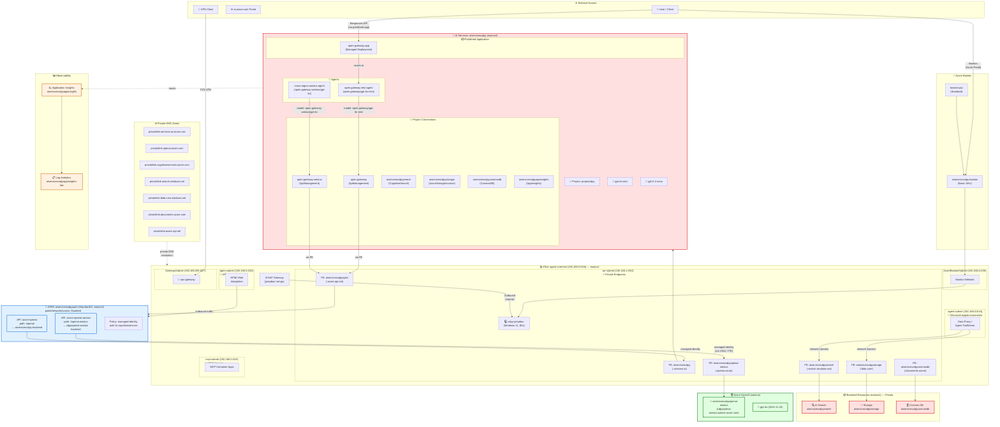

```mermaid
graph TB
    %% ============================================================
    %% External Access
    %% ============================================================
    subgraph External["🌐 External Access"]
        User["👤 User / Client"]
        Portal["🌐 ai.azure.com Portal"]
        VPNClient["🔐 VPN Client"]
    end

    %% ============================================================
    %% Azure Bastion + Jump Box
    %% ============================================================
    subgraph Bastion["🏰 Azure Bastion"]
        BastionHost["aiservicescdpy-bastion\n(Basic SKU)"]
        BastionPIP["bastion-pip\n(Standard)"]
    end

    %% ============================================================
    %% Virtual Network (eastus2)
    %% ============================================================
    subgraph VNet["🔒 VNet: agent-vnet-test (192.168.0.0/16) — eastus2"]

        subgraph AgentSubnet["agent-subnet (192.168.0.0/24)\n🤖 Microsoft.App/environments"]
            DataProxy["Data Proxy /\nAgent ToolServer"]
        end

        subgraph PESubnet["pe-subnet (192.168.1.0/24)\n🔗 Private Endpoints"]
            PE_AI["PE: aiservicescdpy\n(.services.ai)"]
            PE_Search["PE: aiservicescdpysearch\n(.search.windows.net)"]
            PE_Storage["PE: aiservicescdpystorage\n(.blob.core)"]
            PE_Cosmos["PE: aiservicescdpycosmosdb\n(.documents.azure)"]
            PE_APIM["PE: aiservicescdpyapim\n(.azure-api.net)"]
            PE_WestUS["PE: aiservicescdpyopenai-westus\n(.openai.azure)"]
            JumpBox["💻 cdpy-jumpbox\n(Windows 11, B2s)"]
        end

        subgraph MCPSubnet["mcp-subnet (192.168.2.0/24)\n📡 MCP Servers"]
            MCP["MCP Container Apps"]
        end

        subgraph APIMSubnet["apim-subnet (192.168.3.0/24)\n🔄 APIM Outbound"]
            APIMOutbound["APIM VNet\nIntegration"]
        end

        subgraph BastionSubnet["AzureBastionSubnet (192.168.4.0/26)"]
            BastionNet["Bastion Network"]
        end

        subgraph GWSubnet["GatewaySubnet (192.168.255.0/27)"]
            VPNGateway["🔐 vpn-gateway"]
        end

        NATGateway["🌐 NAT Gateway\n(jumpbox-nat-gw)"]
    end

    %% ============================================================
    %% AI Services (eastus2) — Private
    %% ============================================================
    subgraph AIServices["🧠 AI Services: aiservicescdpy (eastus2)\npublicNetworkAccess: Disabled"]
        Project["📂 Project: projectcdpy"]
        Model_Mini["🤖 gpt-4o-mini"]
        Model_Nano["🤖 gpt-5.4-nano"]

        subgraph Connections["🔌 Project Connections"]
            Conn_APIM["apim-gateway\n(ApiManagement)"]
            Conn_APIM_WUS["apim-gateway-westus\n(ApiManagement)"]
            Conn_Search["aiservicescdpysearch\n(CognitiveSearch)"]
            Conn_Storage["aiservicescdpystorage\n(AzureStorageAccount)"]
            Conn_Cosmos["aiservicescdpycosmosdb\n(CosmosDB)"]
            Conn_AppIns["aiservicescdpyappinsights\n(AppInsights)"]
        end

        subgraph Agents["🤖 Agents"]
            Agent1["apim-gateway-test-agent\n(apim-gateway/gpt-4o-mini)"]
            Agent2["cross-region-westus-agent\n(apim-gateway-westus/gpt-4o)"]
        end

        subgraph AppPublished["📦 Published Application"]
            AgentApp["apim-gateway-app\n(Managed Deployment)"]
        end
    end

    %% ============================================================
    %% APIM (eastus2) — Private + VNet Integration
    %% ============================================================
    subgraph APIM["🔀 APIM: aiservicescdpyapim (StandardV2, eastus2)\npublicNetworkAccess: Disabled"]
        API_EastUS["API: azure-openai\npath: /openai\n→ aiservicescdpy backend"]
        API_WestUS["API: azure-openai-westus\npath: /openai-westus\n→ cdpyopenai-westus backend"]
        APIMPolicy["Policy: managed-identity\nauth to cognitiveservices"]
    end

    %% ============================================================
    %% Backend Resources (eastus2) — Private
    %% ============================================================
    subgraph BackendEastUS["📦 Backend Resources (eastus2) — Private"]
        Search["🔍 AI Search\naiservicescdpysearch"]
        Storage["💾 Storage\naiservicescdpystorage"]
        Cosmos["🗄️ Cosmos DB\naiservicescdpycosmosdb"]
    end

    %% ============================================================
    %% Cross-Region OpenAI (westus)
    %% ============================================================
    subgraph WestUS["🌎 Azure OpenAI (westus)"]
        OpenAI_WUS["🧠 aiservicescdpyopenai-westus\n(cdpyopenai-westus.openai.azure.com)"]
        Model_4o["🤖 gpt-4o (2024-11-20)"]
    end

    %% ============================================================
    %% Observability
    %% ============================================================
    subgraph Observability["📊 Observability"]
        AppInsights["📈 Application Insights\naiservicescdpyappinsights"]
        LogAnalytics["📋 Log Analytics\naiservicescdpyappinsights-law"]
    end

    %% ============================================================
    %% Private DNS Zones (global)
    %% ============================================================
    subgraph DNS["🌐 Private DNS Zones"]
        DNS1["privatelink.services.ai.azure.com"]
        DNS2["privatelink.openai.azure.com"]
        DNS3["privatelink.cognitiveservices.azure.com"]
        DNS4["privatelink.search.windows.net"]
        DNS5["privatelink.blob.core.windows.net"]
        DNS6["privatelink.documents.azure.com"]
        DNS7["privatelink.azure-api.net"]
    end

    %% ============================================================
    %% Connections / Flows
    %% ============================================================

    %% User access flows
    User -->|"Responses API\n(via published app)"| AgentApp
    VPNClient -->|"P2S VPN"| VPNGateway
    User -->|"Bastion\n(Azure Portal)"| BastionHost
    BastionHost --> BastionNet
    BastionNet --> JumpBox
    BastionPIP --> BastionHost
    NATGateway -->|"Outbound\nInternet"| JumpBox

    %% Agent execution flows
    Agent1 -->|"model: apim-gateway/gpt-4o-mini"| Conn_APIM
    Agent2 -->|"model: apim-gateway-westus/gpt-4o"| Conn_APIM_WUS
    AgentApp -->|"routes to"| Agent1

    %% APIM gateway flows
    Conn_APIM -->|"via PE"| PE_APIM
    PE_APIM --> APIM
    Conn_APIM_WUS -->|"via PE"| PE_APIM

    API_EastUS -->|"managed identity"| PE_AI
    API_WestUS -->|"managed identity\n(via VNet + PE)"| PE_WestUS
    APIMOutbound -->|"outbound traffic"| APIM

    %% Backend private endpoint flows
    PE_AI --> AIServices
    PE_Search --> Search
    PE_Storage --> Storage
    PE_Cosmos --> Cosmos
    PE_WestUS --> OpenAI_WUS

    %% Data Proxy flows
    DataProxy -->|"network injection"| PE_Search
    DataProxy -->|"network injection"| PE_Storage

    %% Observability
    AIServices -.->|"traces"| AppInsights
    AppInsights --> LogAnalytics

    %% DNS resolution
    DNS -.->|"private DNS\nresolution"| VNet

    %% Styling
    classDef private fill:#ffe0e0,stroke:#cc0000,stroke-width:2px
    classDef apim fill:#e0f0ff,stroke:#0066cc,stroke-width:2px
    classDef westus fill:#e0ffe0,stroke:#006600,stroke-width:2px
    classDef observability fill:#fff0e0,stroke:#cc6600,stroke-width:2px

    class AIServices,Search,Storage,Cosmos private
    class APIM,API_EastUS,API_WestUS apim
    class WestUS,OpenAI_WUS,Model_4o westus
    class AppInsights,LogAnalytics observability
```
