# Architecture Diagram

## Infrastructure Overview

```mermaid
%%{init: {'theme': 'base', 'themeVariables': { 'fontFamily': 'Segoe UI, sans-serif', 'fontSize': '14px', 'primaryColor': '#e0f2fe', 'primaryTextColor': '#1e293b', 'primaryBorderColor': '#0284c7', 'lineColor': '#64748b', 'secondaryColor': '#f0fdf4', 'tertiaryColor': '#fef3c7' }, 'flowchart': { 'useMaxWidth': false, 'nodeSpacing': 40, 'rankSpacing': 80, 'curve': 'basis', 'htmlLabels': true } }}%%

flowchart LR

    %% ── WHO CONNECTS ──────────────────────────────────────────
    subgraph Users [" 👤  Users "]
        direction TB
        User(["API Client"])
        Teams(["Teams User"])
        Admin(["Admin / Portal"])
        VPN(["VPN Client"])
    end

    %% ── HOW THEY GET IN ───────────────────────────────────────
    subgraph Edge [" 🛡️  Edge / Ingress "]
        direction TB
        AppGW["App Gateway\n+ WAF v2 + TLS"]
        Bastion["Azure Bastion"]
        VPNGw["VPN Gateway"]
    end

    %% ── AI FOUNDRY────────────────────────────────────────────
    subgraph Foundry [" 🧠  AI Foundry  (primary region, public access disabled) "]
        direction TB

        subgraph Apps [" Published Applications "]
            direction LR
            GWApp["apim-gateway-app"]
            PipeApp["marketing-pipeline-app"]
        end

        subgraph AgentLayer [" 🧠 AI Services  (aiservicescdpy) — Agents & Workflows "]
            direction LR
            Agents["Agents\n(Gateway, Cross-region,\nMarketing Pipeline)"]
        end

        subgraph ModelLayer [" 🎯 Model Deployments "]
            direction LR
            Models["gpt-4o-mini  •  gpt-5.4-nano"]
        end
    end

    %% ── APIM GATEWAY ─────────────────────────────────────────
    subgraph APIM [" 🔀  APIM Gateway  (private, aiservicescdpyapim) "]
        direction TB
        APIMCore["APIM StandardV2"]
    end

    %% ── BACKEND DATA ─────────────────────────────────────────
    subgraph Backend [" 💾  Backend Data  (private) "]
        direction TB
        Search["AI Search"]
        Storage["Storage Account"]
        Cosmos["Cosmos DB"]
    end

    %% ── CROSS-REGION ─────────────────────────────────────────
    subgraph XRegion [" 🌎  Cross-region OpenAI (westus) "]
        direction TB
        XOpenAI["Azure OpenAI\n(cdpyopenai-westus)"]
        XModel["gpt-4o"]
    end

    %% ── OBSERVABILITY ────────────────────────────────────────
    subgraph Observe [" 📊  Observability "]
        direction TB
        AppIns["Application Insights"]
        LogAn["Log Analytics"]
    end

    %% ═══════════════════════════════════════════════════════════
    %% CONNECTIONS — matching sequence diagram flows
    %% ═══════════════════════════════════════════════════════════

    %% --- Flow 1: Published Agent (User → App Gateway → APIM → Foundry) ---
    User -- "POST /applications/.../responses\nBearer (Entra ID)" --> AppGW
    AppGW -- "TLS termination\nWAF inspection" --> APIMCore

    %% --- Flow 4: Teams → App Gateway → APIM → Agent ---
    Teams -- "POST /bot\nBearer (Entra ID)" --> AppGW

    %% --- Admin / VPN access ---
    Admin -- "portal" --> Bastion
    VPN -- "P2S tunnel" --> VPNGw

    %% --- APIM → Foundry Agent via Activity Protocol ---
    APIMCore -- "Activity Protocol" --> AgentLayer

    %% --- Foundry internal: App → Agents ---
    GWApp --> Agents
    PipeApp --> Agents

    %% --- Agents → APIM (model traffic) ---
    Agents --> APIMCore

    %% --- APIM → AI Services (managed identity auth) ---
    APIMCore -- "Bearer (MI token)" --> AgentLayer

    %% --- Agents connect to Models ---
    AgentLayer --> Models

    %% --- APIM cross-region → westus OpenAI ---
    APIMCore -- "cross-region route" --> XOpenAI --> XModel

    %% --- Foundry → Backend Data ---
    Foundry --> Search
    Foundry --> Storage
    Foundry --> Cosmos

    %% --- Observability ---
    Foundry -. "OpenTelemetry traces\ninvoke_agent + chat metrics" .-> AppIns --> LogAn

    %% ═══════════════════════════════════════════════════════════
    %% STYLES — six distinct roles
    %% ═══════════════════════════════════════════════════════════
    classDef user fill:#fef3c7,stroke:#d97706,stroke-width:1.5px,color:#78350f
    classDef edge fill:#fce7f3,stroke:#db2777,stroke-width:1.5px,color:#831843
    classDef ai   fill:#ccfbf1,stroke:#0d9488,stroke-width:1.5px,color:#134e4a
    classDef data fill:#fee2e2,stroke:#dc2626,stroke-width:1.5px,color:#7f1d1d
    classDef obs  fill:#f1f5f9,stroke:#64748b,stroke-width:1.5px,color:#334155
    class User,Teams,Admin,VPN user
    class AppGW,Bastion,VPNGw edge
    class GWApp,PipeApp,Agents,Models,APIMCore ai
    class Search,Storage,Cosmos,XOpenAI,XModel data
    class AppIns,LogAn obs
```

## Notes

- This architecture diagram shows Azure components at a high level (networking layer abstracted).
- Traffic flows from `sequence-diagram.md`:
  - **Flow 1** — Published Agent: User → App Gateway → APIM (MI auth) → AI Services → gpt-4o-mini
  - **Flow 2** — Cross-Region Agent: Agent → APIM → westus OpenAI → gpt-4o
  - **Flow 3** — Marketing Pipeline: Workflow Engine orchestrates analyst → copywriter → editor, each calling APIM → LLM
  - **Flow 4** — Teams: Teams User → App Gateway → APIM → Foundry Agent (Activity Protocol)
- APIM uses managed identity (`authentication-managed-identity`) for AI Services auth.
- All traffic between components traverses private endpoints within a VNet (see `sequence-diagram.md` for details).
