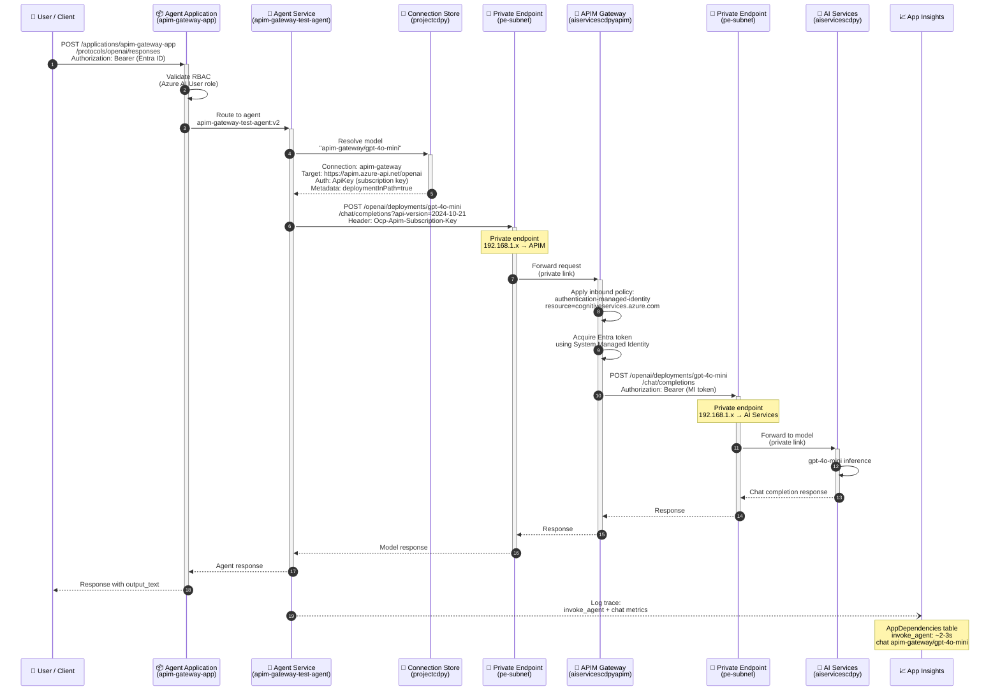
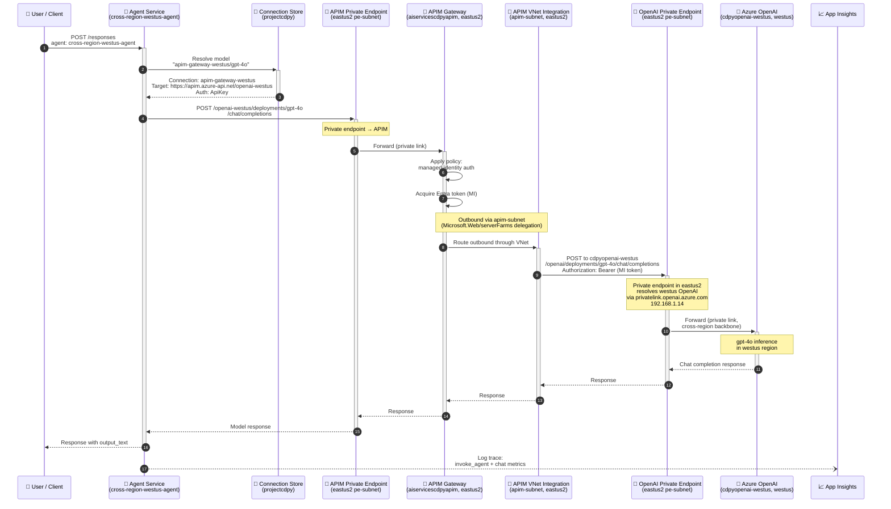

# Sequence Diagram: Agent Interaction via APIM Gateway

## Flow 1: Published Agent (eastus2 — gpt-4o-mini)

```mermaid
sequenceDiagram
    autonumber
    participant User as 👤 User / Client
    participant App as 📦 Agent Application<br/>(apim-gateway-app)
    participant Agent as 🤖 Agent Service<br/>(apim-gateway-test-agent)
    participant ConnStore as 🔌 Connection Store<br/>(projectcdpy)
    participant PE_APIM as 🔗 Private Endpoint<br/>(pe-subnet)
    participant APIM as 🔀 APIM Gateway<br/>(aiservicescdpyapim)
    participant PE_AI as 🔗 Private Endpoint<br/>(pe-subnet)
    participant LLM as 🧠 AI Services<br/>(aiservicescdpy)
    participant AppIns as 📈 App Insights

    User->>+App: POST /applications/apim-gateway-app<br/>/protocols/openai/responses<br/>Authorization: Bearer (Entra ID)
    App->>App: Validate RBAC<br/>(Azure AI User role)
    App->>+Agent: Route to agent<br/>apim-gateway-test-agent:v2

    Agent->>+ConnStore: Resolve model<br/>"apim-gateway/gpt-4o-mini"
    ConnStore-->>-Agent: Connection: apim-gateway<br/>Target: https://apim.azure-api.net/openai<br/>Auth: ApiKey (subscription key)<br/>Metadata: deploymentInPath=true

    Agent->>+PE_APIM: POST /openai/deployments/gpt-4o-mini<br/>/chat/completions?api-version=2024-10-21<br/>Header: Ocp-Apim-Subscription-Key
    Note over PE_APIM: Private endpoint<br/>192.168.1.x → APIM

    PE_APIM->>+APIM: Forward request<br/>(private link)
    APIM->>APIM: Apply inbound policy:<br/>authentication-managed-identity<br/>resource=cognitiveservices.azure.com
    APIM->>APIM: Acquire Entra token<br/>using System Managed Identity

    APIM->>+PE_AI: POST /openai/deployments/gpt-4o-mini<br/>/chat/completions<br/>Authorization: Bearer (MI token)
    Note over PE_AI: Private endpoint<br/>192.168.1.x → AI Services

    PE_AI->>+LLM: Forward to model<br/>(private link)
    LLM->>LLM: gpt-4o-mini inference
    LLM-->>-PE_AI: Chat completion response

    PE_AI-->>-APIM: Response
    APIM-->>-PE_APIM: Response
    PE_APIM-->>-Agent: Model response

    Agent-->>-App: Agent response
    App-->>-User: Response with output_text

    Agent--)AppIns: Log trace:<br/>invoke_agent + chat metrics
    Note over AppIns: AppDependencies table<br/>invoke_agent: ~2-3s<br/>chat apim-gateway/gpt-4o-mini
```

## Flow 2: Cross-Region Agent (eastus2 → westus — gpt-4o)

```mermaid
sequenceDiagram
    autonumber
    participant User as 👤 User / Client
    participant Agent as 🤖 Agent Service<br/>(cross-region-westus-agent)
    participant ConnStore as 🔌 Connection Store<br/>(projectcdpy)
    participant PE_APIM as 🔗 APIM Private Endpoint<br/>(eastus2 pe-subnet)
    participant APIM as 🔀 APIM Gateway<br/>(aiservicescdpyapim, eastus2)
    participant VNetInt as 🔄 APIM VNet Integration<br/>(apim-subnet, eastus2)
    participant PE_WUS as 🔗 OpenAI Private Endpoint<br/>(eastus2 pe-subnet)
    participant LLM_WUS as 🧠 Azure OpenAI<br/>(cdpyopenai-westus, westus)
    participant AppIns as 📈 App Insights

    User->>+Agent: POST /responses<br/>agent: cross-region-westus-agent

    Agent->>+ConnStore: Resolve model<br/>"apim-gateway-westus/gpt-4o"
    ConnStore-->>-Agent: Connection: apim-gateway-westus<br/>Target: https://apim.azure-api.net/openai-westus<br/>Auth: ApiKey

    Agent->>+PE_APIM: POST /openai-westus/deployments/gpt-4o<br/>/chat/completions
    Note over PE_APIM: Private endpoint → APIM

    PE_APIM->>+APIM: Forward (private link)
    APIM->>APIM: Apply policy:<br/>managed-identity auth
    APIM->>APIM: Acquire Entra token (MI)

    Note over APIM,VNetInt: Outbound via apim-subnet<br/>(Microsoft.Web/serverFarms delegation)
    APIM->>+VNetInt: Route outbound through VNet

    VNetInt->>+PE_WUS: POST to cdpyopenai-westus<br/>/openai/deployments/gpt-4o/chat/completions<br/>Authorization: Bearer (MI token)
    Note over PE_WUS: Private endpoint in eastus2<br/>resolves westus OpenAI<br/>via privatelink.openai.azure.com<br/>192.168.1.14

    PE_WUS->>+LLM_WUS: Forward (private link,<br/>cross-region backbone)
    Note over LLM_WUS: gpt-4o inference<br/>in westus region
    LLM_WUS-->>-PE_WUS: Chat completion response

    PE_WUS-->>-VNetInt: Response
    VNetInt-->>-APIM: Response
    APIM-->>-PE_APIM: Response
    PE_APIM-->>-Agent: Model response

    Agent-->>-User: Response with output_text

    Agent--)AppIns: Log trace:<br/>invoke_agent + chat metrics
```
