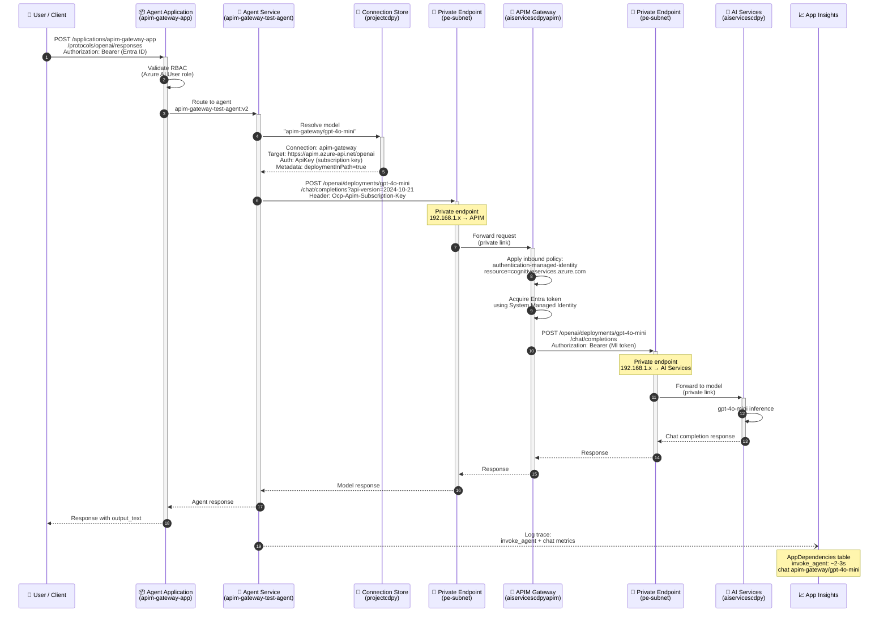
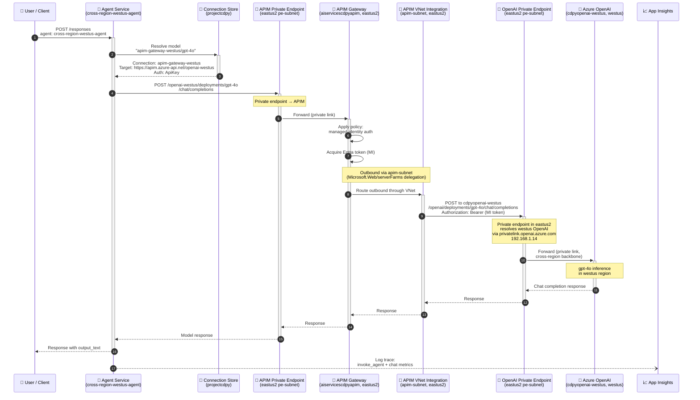
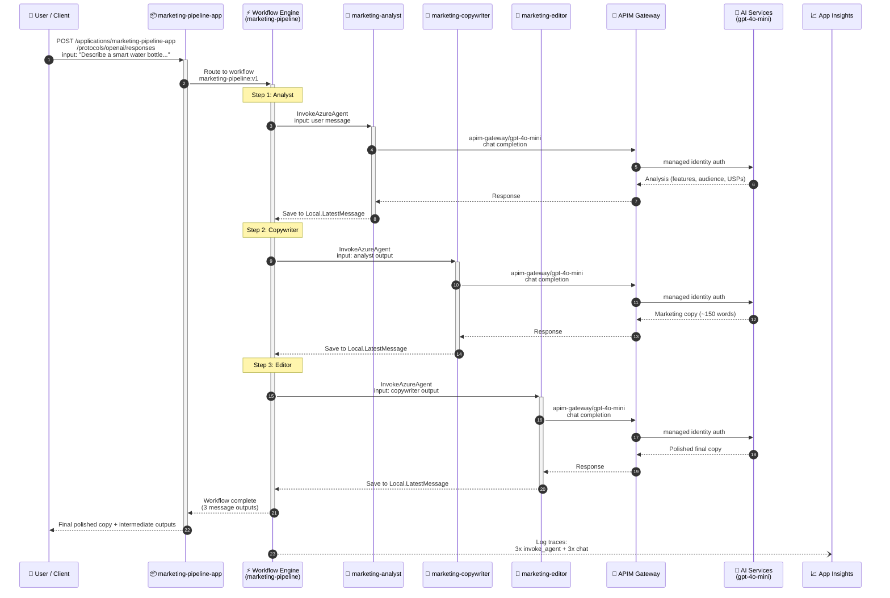
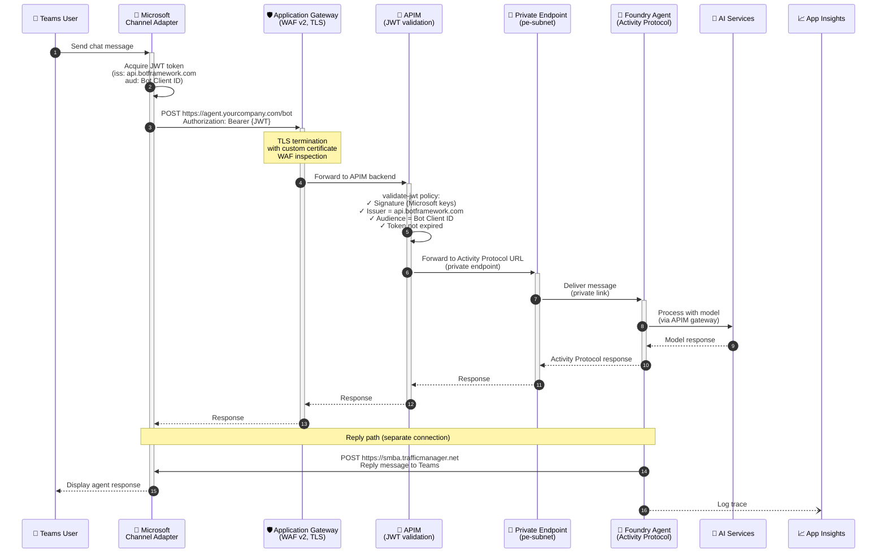

# Sequence Diagram: Agent Interaction via APIM Gateway

## Flow 1: Published Agent (eastus2 — gpt-4o-mini)

## Flow 2: Cross-Region Agent (eastus2 → westus — gpt-4o)

## Flow 3: Marketing Pipeline Workflow (Sequential)

## Flow 4: Teams Integration (Private Agent via App Gateway + APIM)

